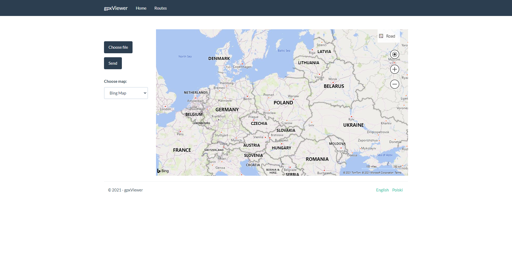
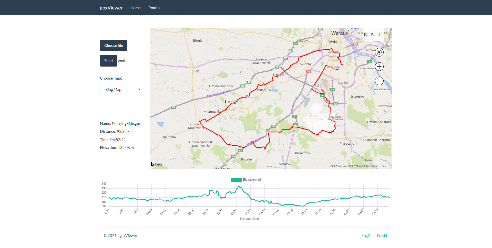
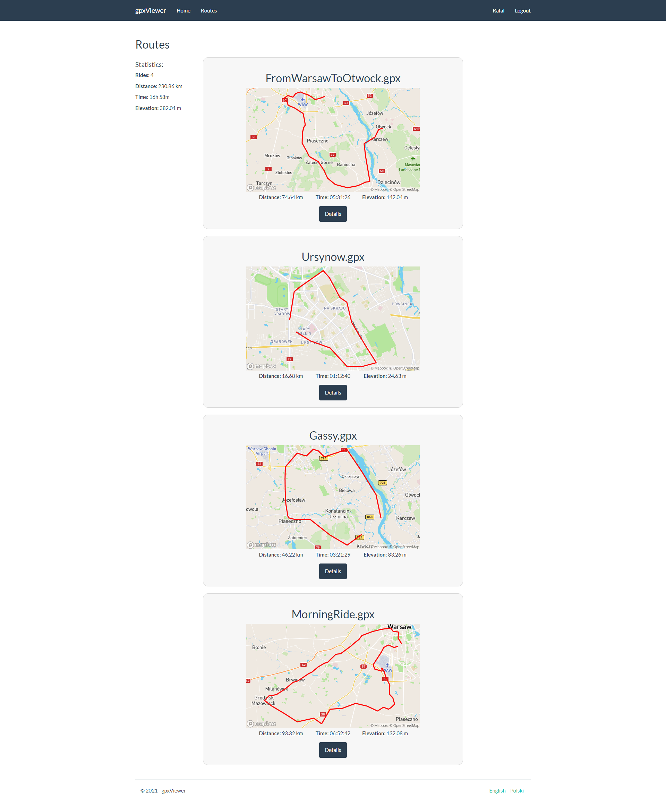
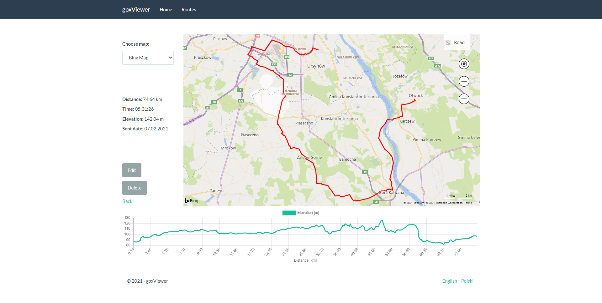

# GPX Viewer
GPX Viewer is a web aplication to show gpx route on map, generate elevation chart and calculate route distance, time, elevation. Routes and calculated data are saved to database, also user login and registration is implemented.  Application uses Bing Maps, Google Maps and OpenStreetMap.

## Technologies
* C#
* ASP.NET MVC
* .NET Framework 4.7.2
* HTML, CSS, JavaScript
* Entity Framework
* Bootstrap

## Application home view

## Loaded map home view

## Routes view

## Details view

